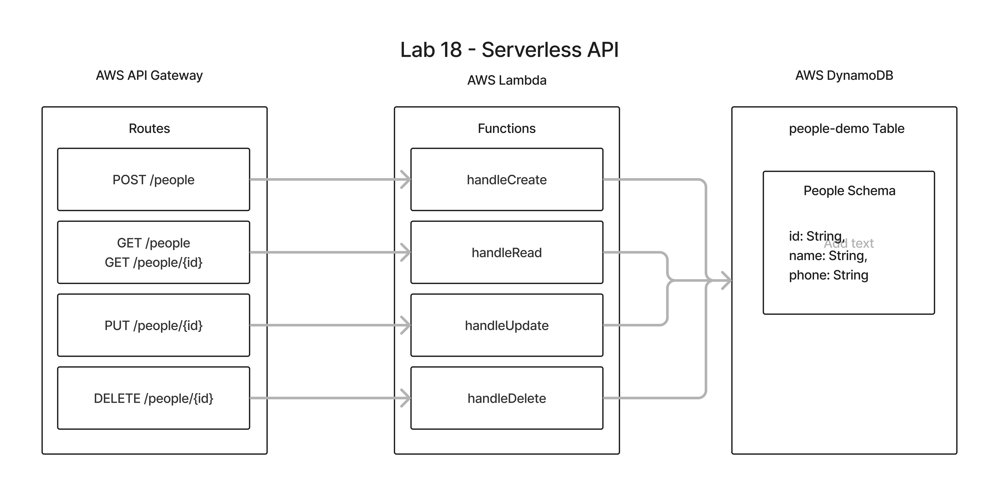

# LAB - Class 18

## Project: Serverless API with AWS API Gateway, DynamoDB, and Lambda

### Author: Branden Ge

### Problem Domain

This lab demonstrates how to create and deploy a serverless API using AWS API Gateway, Lambda, DynamoDB, and Dynamoose.

- [Root Deployed URL](https://zywkvgggmf.execute-api.us-east-2.amazonaws.com/prod)

#### Features / Routes

- POST : `/people` - returns the posted/created person record. Requires an valid object in the request body.
- GET : `/people` - returns all people records
- GET : `/people/:id` - returns a person's record by id
- PUT : `/people/:id` - returns the updated person record by id
- DELETE : `/people/:id` - returns 'Delete successful' if the delete by id is successful

#### Schema

``` JavaScript
{
  "id": String,
  "name": String,
  "phone": String
}
```

#### Tests

- `npm test` to run tests

#### Whiteboard



Diagram created with [Figma](https://www.figma.com/)

#### Credits: [Demo code from Ryan Gallaway at Code Fellows](https://github.com/codefellows/seattle-code-javascript-401d48/tree/main/class-18/inclass-demo)
